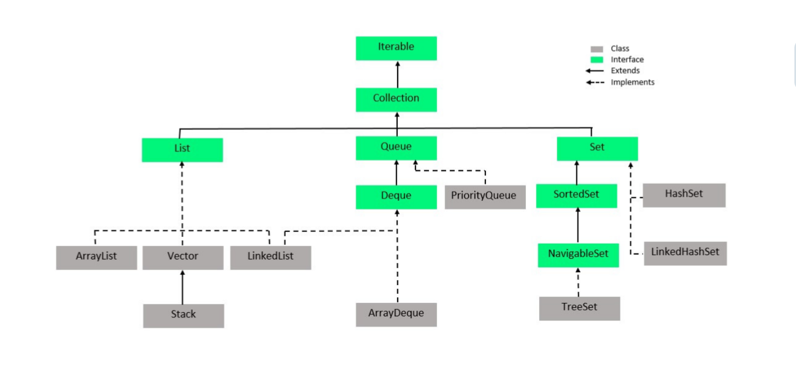
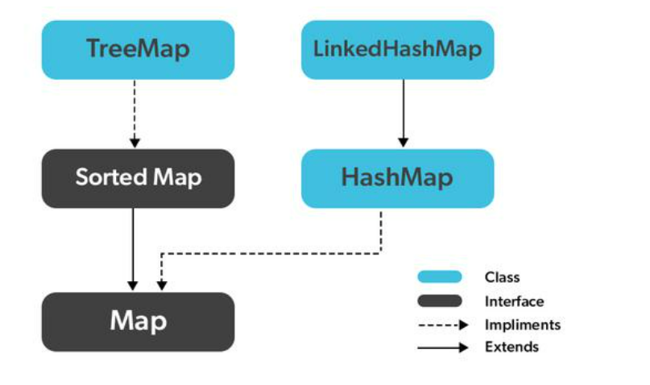
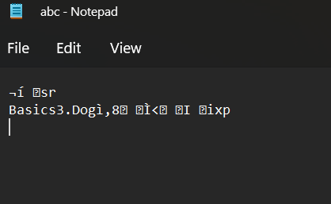

# LearningJava
Random fun with Java
### This repo contains basics of java learning from oops, abstract classes, collections and other APIs.
<b><h4> 1. All collections </h4>

<b><h4> 2. Collections Framework dependency graph with iterables and classes.</h4>

<b><h4> 3. Maps as collections </h4>

<b><h4> 4. Serialization Result of Dog </h4>

